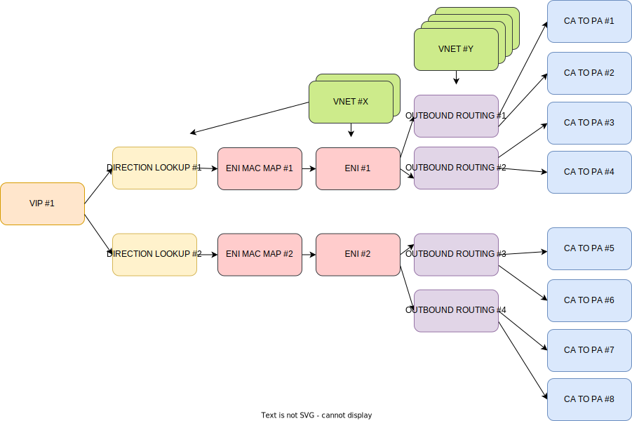

# Traffic scaling scheme


# Config
## Part of config that represents [picture above](#traffic-scaling-scheme):
```python
NUMBER_OF_VIP = 1
NUMBER_OF_DLE = 2
NUMBER_OF_ENI = 2
NUMBER_OF_EAM = NUMBER_OF_ENI
NUMBER_OF_ORE = 2  # Per ENI
NUMBER_OF_OCPE = 2  # Per ORE
NUMBER_OF_VNET = NUMBER_OF_ENI + (NUMBER_OF_ORE * NUMBER_OF_ENI)
```

Each VIP scales to traffic flows with each DIRECTON_LOOKUP.
```python
VIP 172.16.1.100
    DIR_LOOKUP VNI 5000
    DIR_LOOKUP VNI 6000
```

This means that each DIRECTON_LOOKUP refers to its own set of ENI_ETHER_MAP.
The set of ENI_ETHER_MAP for DIRECTON_LOOKUP is formed by the rule: `each DIRECTON_LOOKUP entry has the same amount of ENI_ETHER_MAP refers`.

### Examples of DLE to ENI relations
#### Example 1
```python
NUMBER_OF_DLE = 2
NUMBER_OF_ENI = 2
```
According to this short config, each DIRECTON_LOOKUP refers to one ENI_ETHER_MAP.
```python
VIP "172.16.1.100"
    DIR_LOOKUP VNI 5000
        CA SMAC: "00:CC:CC:CC:00:00"
    DIR_LOOKUP VNI 6000
        CA SMAC: "00:CC:CC:CC:00:01"
```

#### Example 2
```python
NUMBER_OF_DLE = 2
NUMBER_OF_ENI = 4
```
According to this short config, each DIRECTON_LOOKUP refers to two ENI_ETHER_MAP.
```python
VIP "172.16.1.100"
    DIR_LOOKUP VNI 5000
        CA SMAC: "00:CC:CC:CC:00:00"
        CA SMAC: "00:CC:CC:CC:00:01"
    DIR_LOOKUP VNI 6000
        CA SMAC: "00:CC:CC:CC:00:02"
        CA SMAC: "00:CC:CC:CC:00:03"
```

Each ENI_ETHER_MAP refers to one ENI.

ENI scales to OUTBOUND_ROUTING in the ratio: `two OUTBOUND_ROUTING entries per one ENI`.

OUTBOUND_ROUTING scales to OUTBOUND_CA_TO_PA in the ratio: `two OUTBOUND_CA_TO_PA entries per one OUTBOUND_ROUTING`.

## Example of scaling
```python
VIP "172.16.1.100"
    DIR_LOOKUP VNI 5000
        CA SMAC: "00:CC:CC:CC:00:00"
            CA DIP "10.1.1.0", count: 4, step: "0.0.0.1"
        CA SMAC: "00:CC:CC:CC:00:01"
            CA DIP "10.1.1.0", count: 4, step: "0.0.0.1"
    DIR_LOOKUP VNI 6000
        CA SMAC: "00:CC:CC:CC:00:02"
            CA DIP "10.1.1.0", count: 4, step: "0.0.0.1"
        CA SMAC: "00:CC:CC:CC:00:03"
            CA DIP "10.1.1.0", count: 4, step: "0.0.0.1"
```
